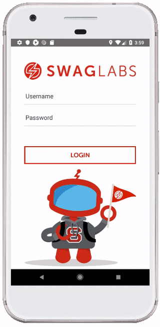
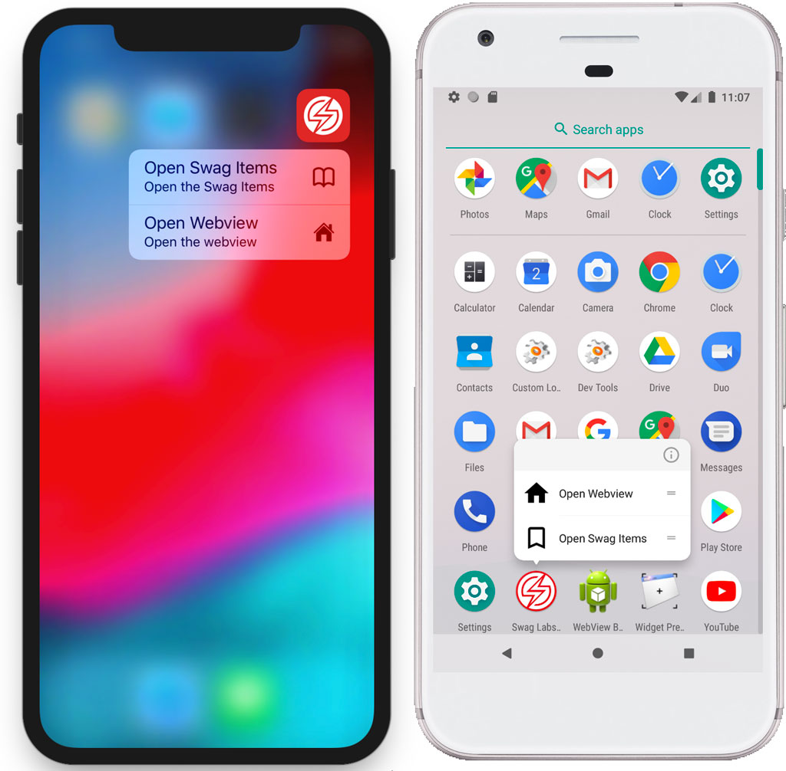
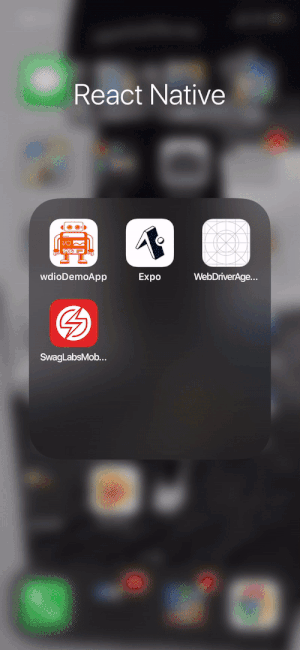
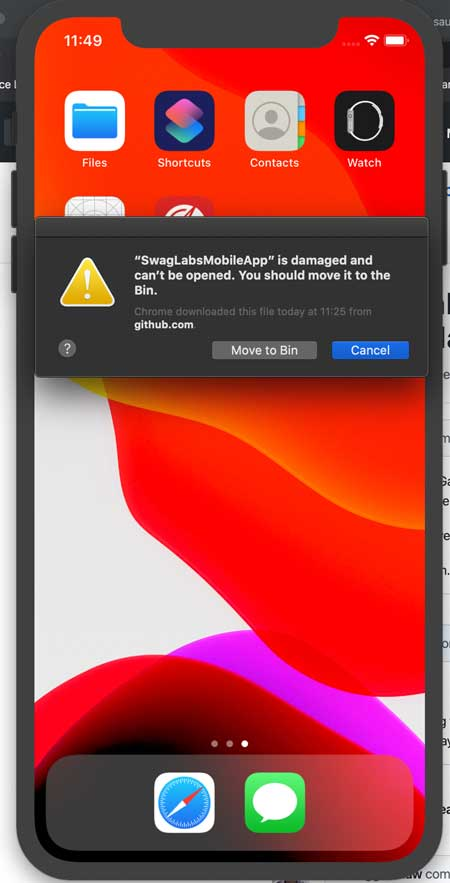

[](https://appcenter.ms)

# Sauce Labs Native Sample Application

In this repository you will find our Sauce Labs sample-app. You can use it as a sample app for testautomation on your local machine or in our Real Device Cloud.
The latest version of the iOS and Android app can be found [here](https://github.com/saucelabs/sample-app-mobile/releases)

 

## Table of contents
1. [Functionalities](#functionalities)
    1. [Touch / Face ID](#touch--face-id)
        1. [Enabling Touch / Face ID on Android emulators](#enabling-touch--face-id-on-android-emulators)
        1. [Enabling Touch / Face ID on iOS simulators](#enabling-touch--face-id-on-ios-simulators)
    1. [Deep linking](#deep-linking)
        1. [Use with Android](#use-with-android)
        1. [Use with iOS](#use-with-ios)
            1. [Terminal](#terminal)
            1. [With Safari](#with-safari)
    1. [3D Touch / Force touch](#3d-touch---force-touch)
    1. [Different languages](#different-languages)
    1. [QR code scanner](#qr-code-scanner)
1. [Contributing to the app](#contributing-to-the-app)
1. [Test-automation](#test-automation)
1. [FAQ](#faq)
 
## Functionalities

### Touch / Face ID
This app supports TouchID and FaceID for Android and iOS and will only show when the phone supports and has this enabled.

See [AUTOMATION.md](./docs/AUTOMATION.md) for using Touch / Face ID with automation.

#### Enabling Touch / Face ID on Android emulators
>**NOTE:**<br>
> The implementation of Touch/FaceID in this application supports the user’s biometrics based on the **insecure** store of the device. It is **not** using the **keystore** which normally should be used when implementing Touch/FaceID and secure login.
> The reason for this is that Sauce Labs is not mocking the keystore on a real device for supporting Touch/FaceID due to **security reasons**.<br/>
> Testing Touch/FaceID which is using the **keystore** on our real devices is therefore **not** supported.

To enable this on Android emulators you need to do the following (when you have an emulator that supports this):

- Open an emulator
- Activate Screenlock from `Settings -> Security`
- Go to `Fingerprint` to add new fingerprint
- When prompt to place your finger on the scanner, emulate the fingerprint using adb command.

    ```bash
    adb -e emu finger touch <finger_id>
    
    #Example
    adb -e emu finger touch 1234
    ```

- You should see fingerprint detected message. That’s it. Done.

> **NOTE:<br>**
> The automation script uses `1234` as the *Fingerprint*, so when you add the fingerprint through ADB, please use `1234` 

> **NOTE:<br>**
> Make sure you remember the fingerprint number you selected, that needs to be used to select a (non)matching finger print!

#### Enabling Touch / Face ID on iOS simulators
To enable this on iOS simulators you need to do the following (when you have a simulator that supports this):

- Open a simulator
- For Touch ID go to the Simulator menu and open `Hardware > Touch ID` and select `Enrolled`
- For Face ID go to the Simulator menu and open `Hardware > Face ID` and select `Enrolled`

In the previous mentioned menu you can also select a (non)matching Touch / Face ID when the phone is asking for it.

### Deep linking
This app supports deep linking for iOS and for Android, this means that screens can directly be opened with a deep link.

The prefix deep link is `swaglabs://` and the following screens (with their arguments) can be used:

- **Swag overview screen:** `swag-overview/ids` where `ids` is a string of numbers from 0-5 separated with a `,`. For example `swag-overview/0,2`. The number represents a product. 
- **Swag details screen:** `swag-item/id` where `id` is a number from 0-5. For example `swag-item/0`   
- **Cart screen:** `cart/ids` where `ids` is a string of numbers from 0-5 separated with a `,`. For example `cart/0,2`. The number represents a product.  
- **Personal info screen:** `personal-info/ids` where `ids` is a string of numbers from 0-5 separated with a `,`. For example `cart/0,2`. The number represents a product.   
- **Checkout overview screen:** `checkout-overview/ids` where `ids` is a string of numbers from 0-5 separated with a `,`. For example `cart/0,2`. The number represents a product.   
- **Complete screen:** `complete`   
- **Webview screen:** `webview`

> **NOTE <br>**
> The *Swag overview | Details | Cart | Personal info | Checkout overview*-screens all need id(s). The id(s) are the numbers of the products of the `InventoryData.ITEMS` in [this](src/js/data/inventory-data.js) file.
> The files are in an `array` and an `array` starts counting from `0`. This means that if you need the first product, you  need to provide the id `0` and if you need to the last product you need to provide the  id `5`.

For how to run the deep link automation script see [Deep Linking](./docs/AUTOMATION.md#deep-linking).

#### Use with Android
Open a terminal and add the following

```bash
# This will open the Checkout overview screen with 2 products in it
adb shell am start -W -a android.intent.action.VIEW -d "swaglabs://checkout-overview/1,2"
``` 

#### Use with iOS
There are 2 ways of using deep links with iOS, through a terminal or through Safari

##### Terminal
Open a terminal and add the following

```bash
# This will open the Swag overview screen with 2 products in it
xcrun simctl openurl booted swaglabs://swag-overview/0,1
```

##### With Safari
Open Safari and type the following

```bash
swaglabs://swag-overview/0,1
```

It will prompt a dialog asking you to open the app, select *Yes* and it will open the screen you selected.

### 3D Touch - Force Touch
This app also supports 3D Touch - Force Touch for devices that support that. 

> **NOTE 1:**<br>
>This app works with a dynamic *quick action menu*. This means that the 3D Touch - Force Touch menu will only be enabled when the app has been opened. 
>When that happens the JavaScript engine in React Native will add quick action items to the iOS and Android source code so the next time the app is opened it has
>those items.

> **NOTE 2:**<br>
>Due to a bug in the module we are using for the 3D Touch - Force Touch the quick actions also only work when the app is in the background.
>Then it can listen to the selected quick action event and get data from it so it will open the right screen.<br>
>The scope of this app is not to test **IF** the quick actions work for this app, the scope is to see how to **automate** 3D Touch / Force Touch

When you installed the app manually you first need to open the app and close to be able to press on the icon to see the 2 options popping up.
This will happens automatically during automation because the app will be opened by Appium by default and you need to close it to test the quick action menu. 

 

### Different languages
This app supports 3 different languages and will automatically check the language of the device to set the right language. The supported languages are:

- English
- Spanish
- Dutch

For the automation of the different languages see [here](./docs/AUTOMATION.md#different-languages)

### QR code scanner
This app now also has a QR code scanner. 

 

You can find it in the menu under the option "QR CODE SCANNER".
This page opens the camera (you first need to allow the app to use the camera) which can be used to scan a QR Code.
If the QR code holds an URL it will automatically open it in a browser. The following image can be used to demo this option.


## Contributing to the app
If you want to contribute to the app and add new functionalities, please check the documentation [here](./docs/CONTRIBUTING.md).

## Test-automation
[Here](./docs/AUTOMATION.md) you will find more information about:

- how to setup Appium
- how to write tests
- how to run tests on a local machine
- how to run tests in the cloud

## FAQ
### Downloaded iOS apps shows 'App is damaged and can't be opened. You should move it to the trash.' after manually install
You can get this warning when you have OSX Catalina or higher and try to install the app manually.

 

This has to do with the new security settings in Catalina. 

> This will not bother you when you install the app through Appium and or Appium desktop.

You can fix this with the following steps before dragging the app to the simulator:

1. Unzip the app
1. Open a terminal and go to the folder where the app is located
1. Execute the following command from the command line
    
        sudo xattr -rd com.apple.quarantine {name-of-the-unzipped-app}.app
        
1. After typing your password the app has been modified and you can drag an drop it manually to the simulator
